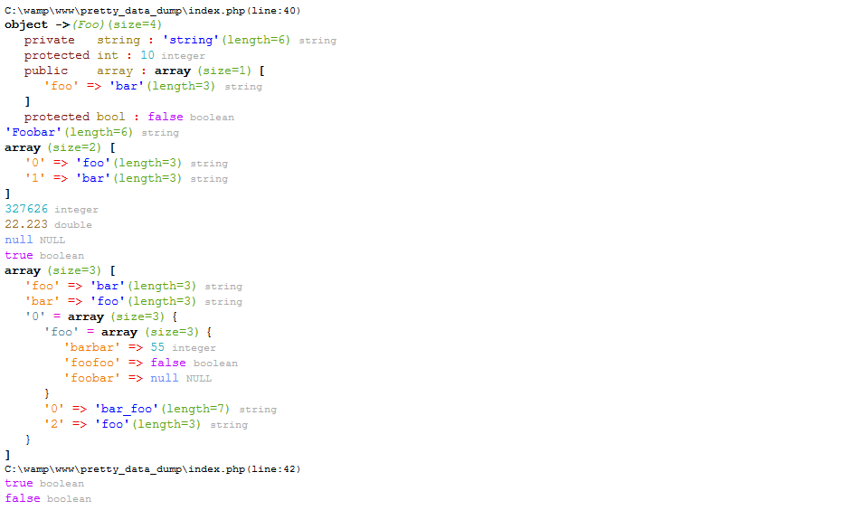
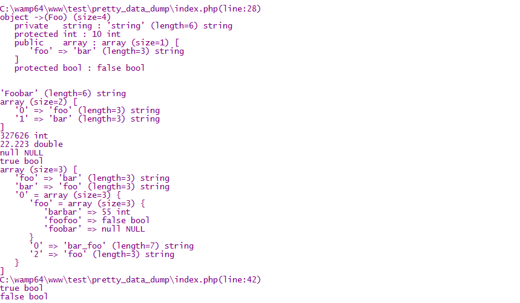

# Pretty Data Dump
A pretty version of php [var_dump](http://php.net/manual/en/function.var-dump.php). This class displays structured information about one or more expressions that includes its type and value.


----------
*Dump implementation in 5.3 is a bit different from 7.0. All new functionality and fixes are implemented on 7.1 though some might be extended to 5.3.*

----------


```php

class Foo
{
	private $string = 'string';
	protected $int = 10;
	public $array = [
	    'foo'   => 'bar'
	];
	protected static $bool = false;
}

$string = 'Foobar';
$array = ['foo', 'bar'];
$int = 327626;
$double = 22.223;
$null = null;
$bool = true;


new Debug\Dump(new Foo, $string, $array, $int, $double, $null, $bool, [
    'foo' => 'bar',
    'bar' => 'foo',
    [
        'foo' => 'foobar',
        'bar_foo',
        2 => 'foo',
        'foo' => [
            'barbar' => 55,
            'foofoo' => false,
            'foobar' => null,
        ]
    ]
]);

new Debug\Dump(1 == '1', 1 === '1');
```
Replacing predefined colors:
```php
Debug\Dump::set('bool', 'F00');
new Debug\Dump(false, true);
```
CGI output:    



CLI output:     
    


