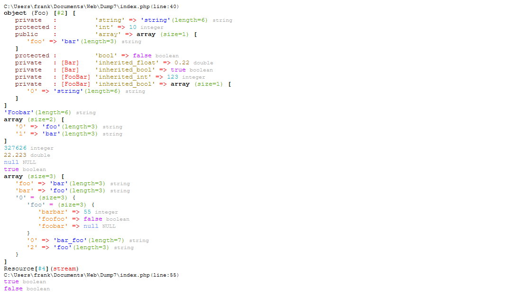
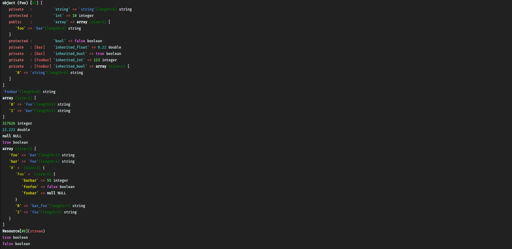
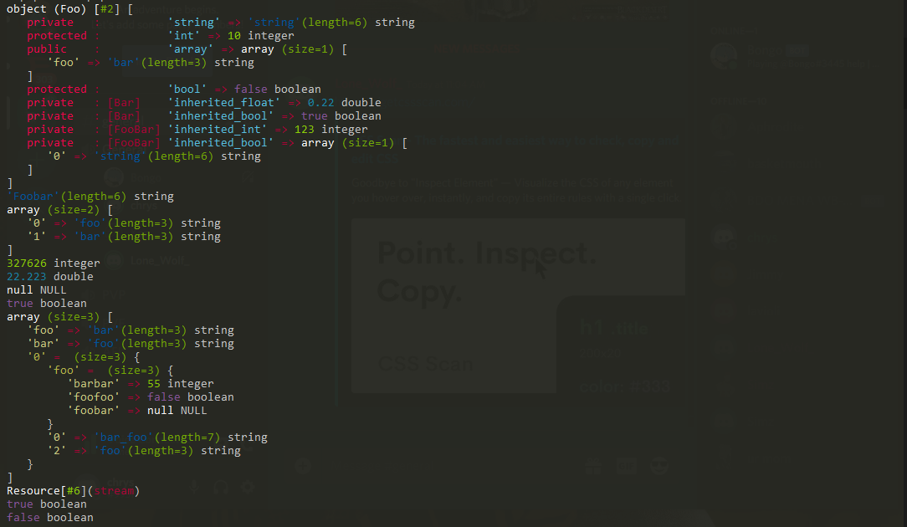

# Pretty Data Dump
A pretty version of php [var_dump](http://php.net/manual/en/function.var-dump.php). This class displays structured information about one or more expressions that includes its type and value.

#Installation   
You can download the  Latest [release version ](https://github.com/Ghostff/pretty_data_dump/releases/) as a standalone, alternatively you can use [Composer](https://getcomposer.org/) 
```json
$ composer require ghostff/dump5
```
```json
"require": {
    "ghostff/dump5": "^1.0"
}
```

```php
class Foo
{
    private $string = 'string';
    protected $int = 10;
    public $array = array(
        'foo'   => 'bar'
    );
    protected static $bool = false;
}

$string = 'Foobar';
$array = array('foo', 'bar');
$int = 327626;
$double = 22.223;
$null = null;
$bool = true;

new Dump(new Foo, $string, $array, $int, $double, $null, $bool, array(
    'foo' => 'bar',
    'bar' => 'foo',
    array(
        'foo' => 'foobar',
        'bar_foo',
        2 => 'foo',
        'foo' => array(
            'barbar' => 55,
            'foofoo' => false,
            'foobar' => null,
        )
    )
));

new Dump(1 == '1', 1 === '1');
```
Replacing predefined colors:
```php
# set($name, [$cgi_color, $cli_color]);
Dump::set('boolean', ['bb02ff', 'purple']);
```
CGI output:    



CLI Posix output:     
    


Windows user who are using command line tools like `cmder` can use the `Dump::d` method:
```php
Dump::d(new Foo, $string, $array, $int, $double, $null, $bool, array(
    'foo' => 'bar',
    'bar' => 'foo',
    array(
        'foo' => 'foobar',
        'bar_foo',
        2 => 'foo',
        'foo' => array(
            'barbar' => 55,
            'foofoo' => false,
            'foobar' => null,
        )
    )
));
```
CLI Windows output:



